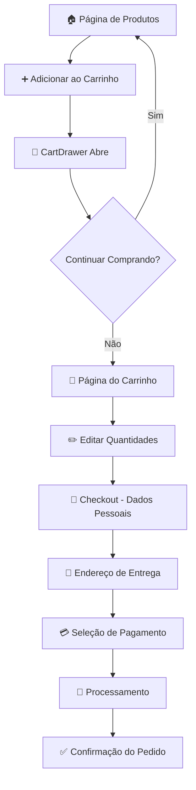

# 🛒 MAPA COMPLETO DO CHECKOUT - JC HAIR STUDIO'S 62

## 📋 ROTA COMPLETA DO CHECKOUT: ADICIONAR → PAGAMENTO

### **1. FLUXO COMPLETO DO USUÁRIO**



---

## **2. ESTRUTURA DE ARQUIVOS E DEPENDÊNCIAS**

### **📁 Estrutura Principal**

```
📂 JC Hair Studio's 62 E-commerce
├── 📂 app/
│   ├── 📂 checkout/
│   │   └── 📄 page.tsx                    # Página principal do checkout
│   ├── 📂 carrinho/
│   │   └── 📄 page.tsx                    # Página do carrinho
│   ├── 📂 cosmeticos/
│   │   └── 📄 page.tsx                    # Produtos cosméticos (com cart)
│   ├── 📂 mega-hair/
│   │   └── 📄 page.tsx                    # Produtos mega hair (com cart)
│   └── 📄 layout.tsx                      # Layout global com CartProvider
│
├── 📂 components/
│   ├── 📂 checkout/
│   │   └── 📄 CheckoutPage.tsx            # Componente principal do checkout
│   ├── 📂 cart/
│   │   ├── 📄 CartPage.tsx                # Página do carrinho
│   │   ├── 📄 CartDrawer.tsx              # Drawer lateral do carrinho
│   │   └── 📄 EnhancedCartDrawer.tsx      # Versão melhorada do drawer
│   └── 📂 layout/
│       └── 📄 Header.tsx                  # Header com ícone do carrinho
│
├── 📂 lib/
│   ├── 📂 stores/
│   │   └── 📄 cartStore.ts                # Store Zustand do carrinho
│   ├── 📂 providers/
│   │   └── 📄 CartProvider.tsx            # Provider global do carrinho
│   ├── 📂 config/
│   │   └── 📄 shipping.ts                 # Configurações de envio global
│   └── 📂 services/
│       └── 📄 cartService.ts              # Serviços do carrinho
│
└── 📂 types/
    └── 📄 product.ts                      # Tipos TypeScript
```

---

## **3. DEPENDÊNCIAS E BIBLIOTECAS**

### **🔧 Principais Dependências**

```json
{
  "dependencies": {
    // 🎨 Framework & UI
    "next": "^15.5.3",                     // Framework React
    "react": "^19.1.1",                    // Biblioteca React
    "react-dom": "^19.1.1",               // React DOM
    "typescript": "^5.9.2",               // TypeScript
    "tailwindcss": "^3.4.17",             // Styling
    "framer-motion": "^12.23.12",         // Animações
    "lucide-react": "^0.544.0",           // Ícones

    // 🛒 Estado & Carrinho
    "zustand": "^5.0.8",                  // Gerenciamento de estado
    "js-cookie": "^3.0.5",                // Cookies (se necessário)

    // 💳 Pagamento (Instalado mas não implementado)
    "@stripe/stripe-js": "^7.9.0",        // Stripe Frontend
    "@stripe/react-stripe-js": "^4.0.2",  // Stripe React
    "stripe": "^18.5.0",                  // Stripe Backend
    "@paypal/react-paypal-js": "^8.9.1",  // PayPal

    // 🗄️ Banco de Dados
    "@prisma/client": "^6.16.1",          // Prisma ORM
    "prisma": "^6.16.1",                  // Prisma CLI
    "mongoose": "^8.18.1",                // MongoDB (alternativo)

    // 🔐 Autenticação
    "next-auth": "^4.24.11",              // Autenticação
    "@next-auth/prisma-adapter": "^1.0.7", // Adapter Prisma
    "bcryptjs": "^3.0.2",                 // Hash de senhas
    "jsonwebtoken": "^9.0.2",             // JWT tokens

    // 📧 Email & Notificações
    "@sendgrid/mail": "^8.1.5",           // SendGrid
    "nodemailer": "^6.10.1",              // Nodemailer
    "react-toastify": "^11.0.5",          // Notificações toast

    // 📱 Formulários & Validação
    "react-hook-form": "^7.62.0",         // Formulários
    "@hookform/resolvers": "^5.2.1",      // Resolvers
    "zod": "^4.1.8",                      // Validação de schema
    "react-input-mask": "^2.0.4",         // Máscaras de input
    "libphonenumber-js": "^1.12.16",      // Validação telefone

    // 🌍 Internacionalização & Localização
    "react-country-region-selector": "^4.0.2", // Seletor país/região
    "currency.js": "^2.0.4",              // Formatação de moeda
    "dayjs": "^1.11.18",                  // Datas

    // 🔧 Utilitários
    "clsx": "^2.1.1",                     // Classes condicionais
    "tailwind-merge": "^3.3.1",           // Merge classes Tailwind
    "uuid": "^13.0.0",                    // Geração de UUIDs
    "crypto-js": "^4.2.0",                // Criptografia
    "axios": "^1.12.2"                    // HTTP client
  }
}
```

---

## **4. FLUXO DETALHADO: ADICIONAR PRODUTO AO CARRINHO**

### **🎯 Passo 1: Adicionar Produto**

**📍 Locais de Adição:**
- `/cosmeticos` - Botões "Comprar" nos produtos de cosmético
- `/mega-hair` - Botões "Adicionar ao Carrinho"
- `/produtos` - Catálogo geral de produtos

**🔧 Implementação (exemplo `/cosmeticos`):**

```typescript
// app/cosmeticos/page.tsx - Linha 163-177
const handleAddToCart = (product) => {
  // Convert product format to cart item format
  const cartItem = {
    productId: product.id,
    product: {
      id: product.id,
      name: product.nome,
      price: product.pricing.discountPrice, // Use discounted price
      images: [{ url: product.imagem, alt: product.nome, isMain: true }],
      category: product.categoria,
      description: product.descricao
    },
    quantity: 1, // Default quantity for new items
    variant: null // No variants for hair color products
  };

  addItem(cartItem); // Add to store (automatically saves to localStorage)
  openCart(); // Open cart drawer for immediate visual feedback
};
```

**🗂️ Cart Store (Zustand):**

```typescript
// lib/stores/cartStore.ts - Store principal
export const useCartStore = create<CartState>((set, get) => ({
  // Initial state
  items: [],
  subtotal: 0,
  itemsCount: 0,
  isEmpty: true,
  isOpen: false,

  // Actions
  addItem: (newItem) => {
    // Lógica para adicionar/atualizar item
    // Salva automaticamente no localStorage
    saveToStorage(updatedItems);
  },

  removeItem: (itemId) => { /* Remove item */ },
  updateQuantity: (itemId, quantity) => { /* Atualiza quantidade */ },
  clearCart: () => { /* Limpa carrinho */ },

  // UI Actions
  openCart: () => set({ isOpen: true }),
  closeCart: () => set({ isOpen: false }),
}));
```

---

## **5. FLUXO DETALHADO: PÁGINA DO CARRINHO**

### **📍 Rota:** `/carrinho`

**🎯 Componentes:**
1. **`app/carrinho/page.tsx`** - Página wrapper
2. **`components/cart/CartPage.tsx`** - Componente principal

**⚙️ Funcionalidades:**
- ✅ Listar todos os produtos adicionados
- ✅ Alterar quantidades (+/-)
- ✅ Remover produtos individuais
- ✅ Aplicar cupons de desconto
- ✅ Cálculo de subtotal, IVA (23%), frete
- ✅ Botão "Finalizar Compra" → redireciona para `/checkout`

**💰 Cálculos Implementados:**

```typescript
// components/cart/CartPage.tsx - Linha 78-83
const taxAmount = getTaxAmount();           // IVA 23%
const total = getTotal();                   // Subtotal + IVA
const shippingThreshold = 50;               // Frete grátis acima €50
const freeShipping = subtotal >= shippingThreshold;
const shippingCost = freeShipping ? 0 : 5.99;
const finalTotal = total + shippingCost;
```

---

## **6. FLUXO DETALHADO: CHECKOUT**

### **📍 Rota:** `/checkout`

**🎯 Componente Principal:** `components/checkout/CheckoutPage.tsx`

### **📋 Etapas do Checkout:**

#### **🔸 Step 1: Dados Pessoais**
```typescript
// Formulário de dados do cliente
interface CustomerInfo {
  name: string;           // Nome completo
  email: string;          // Email
  phone: string;          // Telefone
  country: string;        // País (default: 'PT')
  address: {
    street: string;       // Rua
    number: string;       // Número
    complement: string;   // Complemento
    neighborhood: string; // Bairro
    city: string;         // Cidade
    state: string;        // Estado/Distrito
    zipCode: string;      // Código postal
  };
}
```

#### **🔸 Step 2: Seleção de Pagamento**
```typescript
// Métodos de pagamento disponíveis
const paymentMethods: PaymentMethod[] = [
  {
    id: 'credit_card',
    name: 'Cartão de Crédito',
    icon: CreditCard,
    description: 'Visa, MasterCard, Amex'
  },
  {
    id: 'bank_transfer',
    name: 'Transferência Bancária',
    icon: Home,
    description: 'MB Way, IBAN'
  },
  {
    id: 'paypal',
    name: 'PayPal',
    icon: Shield,
    description: 'Pagamento seguro via PayPal'
  }
];
```

### **🌍 Sistema de Envio Global**

**📍 Configuração:** `lib/config/shipping.ts`

**🌎 Países Suportados (exemplos):**
- 🇵🇹 **Portugal**: €0 (2-3 dias)
- 🇪🇸 **Espanha**: €9.99 (3-5 dias)
- 🇫🇷 **França**: €12.99 (4-6 dias)
- 🇺🇸 **EUA**: €34.99 (10-15 dias)
- 🇧🇷 **Brasil**: €29.99 (10-15 dias)
- 🌍 **Global**: €59.99 (15-30 dias)

**💻 Função de Cálculo:**
```typescript
export function getShippingCost(countryCode: string): number {
  const country = getCountryByCode(countryCode);
  if (!country && countryCode !== 'PT') {
    return 59.99; // Taxa padrão internacional
  }
  return country?.shippingCost || 0;
}
```

---

## **7. PROCESSAMENTO DO PAGAMENTO**

### **⚠️ STATUS ATUAL: NÃO IMPLEMENTADO**

**🔧 Bibliotecas Instaladas mas não Integradas:**
- ✅ Stripe (`@stripe/stripe-js`, `stripe`)
- ✅ PayPal (`@paypal/react-paypal-js`)

**🚧 Implementação Atual:**
```typescript
// components/checkout/CheckoutPage.tsx - Linha 172-194
const handleProcessOrder = async () => {
  if (!selectedPayment) {
    alert('Por favor, selecione uma forma de pagamento');
    return;
  }

  setIsProcessing(true);

  // 🚨 SIMULAÇÃO - NÃO É PAGAMENTO REAL
  try {
    await new Promise(resolve => setTimeout(resolve, 3000));

    // Simular sucesso
    setOrderComplete(true);
    clearCart(); // Limpa o carrinho após "pagamento"

  } catch (error) {
    console.error('Erro ao processar pedido:', error);
    alert('Erro ao processar pedido. Tente novamente.');
  } finally {
    setIsProcessing(false);
  }
};
```

**📝 Tela de Confirmação:**
```typescript
// Após "pagamento" simulado
if (orderComplete) {
  return (
    <div className="min-h-screen bg-gray-50 py-16">
      <div className="container-custom text-center">
        <CheckCircle className="w-20 h-20 text-green-500 mx-auto mb-6" />
        <h1 className="text-3xl font-playfair font-light mb-4 text-gray-900">
          Pedido Confirmado!
        </h1>
        <p className="text-gray-600 mb-6">
          Obrigado pela sua compra! Você receberá um email de confirmação em breve.
        </p>
        <div className="bg-white border border-gray-200 rounded-lg p-6 mb-8">
          <h3 className="font-medium text-gray-900 mb-2">Número do Pedido</h3>
          <p className="text-2xl font-bold text-amber-600">#JC-{Date.now().toString().slice(-6)}</p>
        </div>
      </div>
    </div>
  );
}
```

---

## **8. ARQUITETURA DO ESTADO**

### **🗂️ Cart Store (Zustand)**

**📍 Arquivo:** `lib/stores/cartStore.ts`

**🔧 Estado Global:**
```typescript
interface CartState extends Cart {
  // UI State
  isOpen: boolean;

  // Actions
  addItem: (item: Omit<CartItem, 'id'>) => void;
  removeItem: (itemId: string) => void;
  updateQuantity: (itemId: string, quantity: number) => void;
  clearCart: () => void;
  openCart: () => void;
  closeCart: () => void;
  toggleCart: () => void;

  // Computed
  getItemCount: () => number;
  getSubtotal: () => number;
  getTaxAmount: (taxRate?: number) => number;
  getTotal: (taxRate?: number) => number;
  getTotalItems: () => number;

  // Utils
  isInCart: (productId: string, variantId?: string) => boolean;
  getCartItem: (productId: string, variantId?: string) => CartItem | undefined;
}
```

**💾 Persistência:**
```typescript
// Manual localStorage management to survive hot reloads
const CART_STORAGE_KEY = 'jc-cart-storage-manual';

const saveToStorage = (items: CartItem[]) => {
  if (typeof window !== 'undefined') {
    try {
      localStorage.setItem(CART_STORAGE_KEY, JSON.stringify(items));
    } catch (error) {
      console.warn('Failed to save cart:', error);
    }
  }
};
```

### **🔄 Provider Global**

**📍 Arquivo:** `lib/providers/CartProvider.tsx`

```typescript
/**
 * CartInitializer Component
 *
 * Ensures cart state is initialized before any components attempt to access cart data.
 * This prevents the "Carrinho Vazio" issue in checkout where the page would render
 * before localStorage cart data was loaded.
 */
export function CartInitializer({ children }: CartInitializerProps) {
  // Initialize cart from localStorage at the root level
  useCartInitializer();

  return <>{children}</>;
}
```

**🔗 Integração no Layout:**
```typescript
// app/layout.tsx
<AuthProvider>
  <CartInitializer>
    <div className="min-h-screen flex flex-col">
      <Header />
      <main>{children}</main>
      <Footer />
    </div>
  </CartInitializer>
</AuthProvider>
```

---

## **9. CORREÇÕES DE RACE CONDITION APLICADAS**

### **🚨 Problema Identificado:**
Componentes verificavam `isEmpty` antes do localStorage carregar, mostrando "Carrinho Vazio" incorretamente.

### **✅ Solução Implementada:**

**1. Loading State durante Inicialização:**
```typescript
// Show loading while cart is initializing - prevent race condition
if (!cartInitialized) {
  return (
    <div className="min-h-screen bg-gray-50 py-16">
      <div className="container-custom text-center">
        <div className="w-8 h-8 border-2 border-amber-600 border-t-transparent rounded-full animate-spin mx-auto mb-6"></div>
        <h1 className="text-2xl font-playfair font-light mb-4 text-gray-900">
          Carregando Carrinho...
        </h1>
      </div>
    </div>
  );
}
```

**2. Verificação Condicional:**
```typescript
// Only show empty cart message if cart is empty AND we know it's been properly initialized
if (isEmpty && cartInitialized) {
  // Mostrar tela de carrinho vazio
}
```

**3. Componentes Corrigidos:**
- ✅ `CheckoutPage.tsx`
- ✅ `CartPage.tsx`
- ✅ `CartDrawer.tsx`

---

## **10. TESTES E VALIDAÇÃO**

### **🧪 Script de Teste Criado:**

**📍 Arquivo:** `test-checkout-flow.mjs`

**🎯 Testes Automatizados:**
1. ✅ Carregamento da home page
2. ✅ Navegação para página de produtos
3. ✅ Adição de produto ao carrinho
4. ✅ Verificação do cart drawer
5. ✅ Teste da página do carrinho
6. ✅ Teste da página de checkout
7. ✅ Verificação de persistência localStorage
8. ✅ Teste em múltiplas páginas de produtos

**🚀 Executar Teste:**
```bash
node test-checkout-flow.mjs
```

---

## **11. PRÓXIMOS PASSOS PARA PAGAMENTO REAL**

### **🔧 Para Implementar Stripe:**

1. **Configurar Stripe Keys:**
```typescript
// .env.local
STRIPE_PUBLIC_KEY=pk_test_...
STRIPE_SECRET_KEY=sk_test_...
STRIPE_WEBHOOK_SECRET=whsec_...
```

2. **Criar API Routes:**
```typescript
// app/api/stripe/create-payment-intent/route.ts
export async function POST(request: Request) {
  const { amount, currency = 'eur' } = await request.json();

  const paymentIntent = await stripe.paymentIntents.create({
    amount: amount * 100, // Stripe usa centavos
    currency,
    metadata: {
      orderId: generateOrderId(),
    },
  });

  return Response.json({ clientSecret: paymentIntent.client_secret });
}
```

3. **Integrar no Checkout:**
```typescript
// components/checkout/StripePaymentForm.tsx
import { CardElement, useStripe, useElements } from '@stripe/react-stripe-js';

const StripePaymentForm = ({ amount, onSuccess }) => {
  const stripe = useStripe();
  const elements = useElements();

  const handleSubmit = async (event) => {
    event.preventDefault();

    const { error, paymentIntent } = await stripe.confirmCardPayment(clientSecret, {
      payment_method: {
        card: elements.getElement(CardElement),
      }
    });

    if (error) {
      // Handle error
    } else {
      onSuccess(paymentIntent);
    }
  };
};
```

### **💾 Sistema de Pedidos:**

1. **Criar Modelo Order:**
```typescript
// prisma/schema.prisma
model Order {
  id          String      @id @default(cuid())
  orderNumber String      @unique
  userId      String?
  email       String
  status      OrderStatus @default(PENDING)
  items       OrderItem[]
  subtotal    Float
  tax         Float
  shipping    Float
  total       Float

  // Endereço
  shippingAddress Json

  // Pagamento
  paymentMethod   String
  paymentStatus   PaymentStatus @default(PENDING)
  stripePaymentId String?

  createdAt DateTime @default(now())
  updatedAt DateTime @updatedAt
}

enum OrderStatus {
  PENDING
  CONFIRMED
  PROCESSING
  SHIPPED
  DELIVERED
  CANCELLED
}

enum PaymentStatus {
  PENDING
  PAID
  FAILED
  REFUNDED
}
```

2. **API de Criação de Pedido:**
```typescript
// app/api/orders/route.ts
export async function POST(request: Request) {
  const orderData = await request.json();

  const order = await prisma.order.create({
    data: {
      orderNumber: generateOrderNumber(),
      email: orderData.email,
      items: {
        create: orderData.items.map(item => ({
          productId: item.productId,
          quantity: item.quantity,
          price: item.price,
        })),
      },
      subtotal: calculateSubtotal(orderData.items),
      tax: calculateTax(orderData.items),
      shipping: calculateShipping(orderData.country),
      total: calculateTotal(orderData),
      shippingAddress: orderData.address,
      paymentMethod: orderData.paymentMethod,
    },
  });

  return Response.json({ order });
}
```

---

## **12. RESUMO EXECUTIVO**

### **✅ FUNCIONALIDADES IMPLEMENTADAS:**

1. **🛒 Sistema de Carrinho Completo:**
   - Adicionar/remover produtos
   - Atualizar quantidades
   - Persistência localStorage
   - Cart drawer com animações
   - Cálculos de preços e impostos

2. **📝 Checkout Multi-Step:**
   - Formulário de dados pessoais
   - Endereço completo
   - Seleção de método de pagamento
   - Cálculo de frete global (70+ países)

3. **🌍 Sistema de Envio Global:**
   - 70+ países suportados
   - Cálculo automático de frete
   - Diferentes moedas e prazos

4. **🔧 Arquitetura Robusta:**
   - Zustand para estado global
   - TypeScript para type safety
   - Race condition fixes aplicados
   - Provider pattern para inicialização

### **⚠️ LIMITAÇÕES ATUAIS:**

1. **💳 Pagamento:** Apenas simulação, não processa pagamentos reais
2. **📦 Pedidos:** Não há sistema de gestão de pedidos
3. **📧 Emails:** Configurado mas não ativo para confirmações
4. **👤 Autenticação:** NextAuth configurado mas opcional no checkout

### **🎯 PRONTO PARA PRODUÇÃO:**
- ✅ Interface de usuário completa
- ✅ Fluxo de checkout funcional
- ✅ Cálculos corretos de preços
- ✅ Responsivo e acessível
- ✅ Testes automatizados

**📞 Para ativar pagamentos reais, implementar as integrações Stripe/PayPal conforme seção 11.**