# JC Hair Studio - Comprehensive Testing Framework Documentation

**Version:** 1.0.0
**Author:** JC Hair Studio Development Team - Agent 6 (QA Specialist)
**Date:** 2024-09-23
**Last Updated:** 2024-09-23

## 📋 Table of Contents

1. [Overview](#overview)
2. [Testing Architecture](#testing-architecture)
3. [Test Categories](#test-categories)
4. [Notification System Testing](#notification-system-testing)
5. [Admin Panel Testing](#admin-panel-testing)
6. [API Endpoint Testing](#api-endpoint-testing)
7. [Performance Testing](#performance-testing)
8. [Health Monitoring](#health-monitoring)
9. [Running Tests](#running-tests)
10. [Test Results and Reporting](#test-results-and-reporting)
11. [Troubleshooting](#troubleshooting)
12. [Best Practices](#best-practices)

---

## 🎯 Overview

The JC Hair Studio Testing Framework is a comprehensive Quality Assurance system designed to ensure the reliability, performance, and security of our e-commerce platform. This framework provides extensive testing coverage for all critical components of the system.

### Key Features

- ✅ **5-Agent Notification System Testing**
- ✅ **Admin Panel UI Component Testing**
- ✅ **API Endpoint Security and Performance Testing**
- ✅ **Load Testing for High-Volume Operations**
- ✅ **Real-time Health Monitoring**
- ✅ **Production Monitoring Dashboard**
- ✅ **Automated Test Reporting**
- ✅ **Continuous Integration Ready**

---

## 🏗️ Testing Architecture

### Directory Structure

```
tests/
├── admin/                    # Admin panel UI tests
│   └── admin-ui-test-suite.mjs
├── docs/                     # Testing documentation
│   └── TESTING_FRAMEWORK_DOCUMENTATION.md
├── integration/              # API and integration tests
│   └── api-endpoint-test-suite.mjs
├── monitoring/               # Health monitoring tests
│   └── health-monitor-test.mjs
├── notifications/            # Notification system tests
│   ├── advanced-notification-test.mjs
│   └── agent-test-suite.mjs
└── performance/              # Performance and load tests
    └── load-test-suite.mjs
```

### Component Architecture

```mermaid
graph TB
    A[Testing Framework] --> B[Notification Testing]
    A --> C[Admin Panel Testing]
    A --> D[API Testing]
    A --> E[Performance Testing]
    A --> F[Health Monitoring]

    B --> B1[Agent 1: Admin Email]
    B --> B2[Agent 2: Order Confirmation]
    B --> B3[Agent 3: Payment Confirmation]
    B --> B4[Agent 4: Shipping Notification]
    B --> B5[Agent 5: MongoDB Persistence]

    C --> C1[Dashboard Components]
    C --> C2[Order Management]
    C --> C3[Notification Panel]
    C --> C4[Responsive Design]

    D --> D1[Admin APIs]
    D --> D2[Notification APIs]
    D --> D3[Public APIs]
    D --> D4[Security Testing]

    E --> E1[Load Testing]
    E --> E2[Stress Testing]
    E --> E3[Spike Testing]
    E --> E4[Performance Metrics]

    F --> F1[Health Endpoints]
    F --> F2[Service Monitoring]
    F --> F3[Alert System]
    F --> F4[Uptime Tracking]
```



---

## 🧪 Test Categories

### 1. Unit Tests
- Individual function testing
- Component isolation
- Mock data validation

### 2. Integration Tests
- API endpoint testing
- Database connectivity
- Service communication

### 3. End-to-End Tests
- Complete user workflows
- Cross-system integration
- Real-world scenarios

### 4. Performance Tests
- Load testing
- Stress testing
- Scalability assessment

### 5. Security Tests
- Input validation
- SQL injection prevention
- XSS protection

### 6. Monitoring Tests
- Health check validation
- Alert system testing
- Uptime monitoring

---

## 🔔 Notification System Testing

### Overview

The notification system testing framework validates all 5 notification agents that handle critical e-commerce communications.

### Test Files

1. **`advanced-notification-test.mjs`** - Comprehensive notification testing
2. **`agent-test-suite.mjs`** - Individual agent testing

### Notification Agents

#### Agent 1: Admin Email Notification
- **Purpose:** Sends detailed order information to admin
- **Email:** juliocesarurss65@gmail.com
- **Tests:**
  - Email delivery
  - Content accuracy
  - Performance metrics
  - Error handling

#### Agent 2: Customer Order Confirmation
- **Purpose:** Confirms order receipt to customer
- **Tests:**
  - Template validation
  - Customer data accuracy
  - Delivery success rate

#### Agent 3: Payment Confirmation
- **Purpose:** Notifies payment approval
- **Tests:**
  - Payment data validation
  - Transaction ID inclusion
  - Timing accuracy

#### Agent 4: Shipping Notification
- **Purpose:** Provides tracking information
- **Tests:**
  - Tracking code generation
  - Carrier information
  - Delivery estimates

#### Agent 5: MongoDB Persistence & Webhook
- **Purpose:** Data persistence and backup notifications
- **Tests:**
  - Database writes
  - Data integrity
  - Webhook delivery

### Running Notification Tests

```bash
# Run comprehensive notification tests
node tests/notifications/advanced-notification-test.mjs

# Run individual agent tests
node tests/notifications/agent-test-suite.mjs

# Run existing enhanced test (original)
node test-notification-system.mjs
```

### Expected Results

- **Success Rate:** ≥95% for all agents
- **Response Time:** <5 seconds per notification
- **Email Delivery:** 100% for valid addresses
- **Data Persistence:** 100% success rate

---

## 🖥️ Admin Panel Testing

### Overview

Comprehensive UI testing for the admin panel components, ensuring optimal user experience and functionality.

### Test File

- **`admin-ui-test-suite.mjs`** - Complete admin panel testing

### Test Components

#### Dashboard Testing
- Load performance
- Component rendering
- Real-time updates
- Metrics accuracy

#### Order Management Testing
- Table functionality
- Filters and search
- Bulk operations
- Status updates

#### Notification Panel Testing
- Status display
- Action buttons
- Refresh functionality
- Error handling

#### Responsive Design Testing
- Mobile compatibility
- Tablet optimization
- Desktop experience
- Touch interactions

### Running Admin Panel Tests

```bash
# Run admin panel UI tests
node tests/admin/admin-ui-test-suite.mjs
```

### Performance Metrics

- **Page Load Time:** <3 seconds
- **Component Response:** <1 second
- **Mobile Usability:** ≥90% score
- **Accessibility:** WCAG 2.1 compliance

---

## 🔌 API Endpoint Testing

### Overview

Comprehensive testing of all API endpoints for functionality, security, and performance.

### Test File

- **`api-endpoint-test-suite.mjs`** - Complete API testing

### API Categories

#### Admin APIs
- `/api/admin/orders` - Order management
- `/api/admin/notifications` - Notification system
- `/api/admin/products` - Product management

#### Notification APIs
- `/api/payment-success` - Payment confirmations
- `/api/notify-shipping` - Shipping notifications
- `/api/contact` - Contact form
- `/api/newsletter` - Newsletter subscriptions

#### Public APIs
- `/api/health` - Basic health check
- `/api/products` - Product catalog
- `/api/categories` - Product categories
- `/api/search` - Product search

### Security Testing

#### Injection Protection
- SQL injection attempts
- XSS prevention
- CSRF protection
- Input sanitization

#### Rate Limiting
- Request throttling
- DDoS protection
- Fair usage policies

### Running API Tests

```bash
# Run comprehensive API tests
node tests/integration/api-endpoint-test-suite.mjs
```

### Performance Thresholds

- **GET Requests:** <2 seconds
- **POST Requests:** <5 seconds
- **PUT Requests:** <3 seconds
- **DELETE Requests:** <2 seconds
- **Error Rate:** <5%

---

## ⚡ Performance Testing

### Overview

Load testing framework designed to validate system performance under various traffic conditions.

### Test File

- **`load-test-suite.mjs`** - Performance and load testing

### Test Scenarios

#### Light Load (5 concurrent users)
- Normal business hours simulation
- 60-second duration
- Baseline performance metrics

#### Moderate Load (15 concurrent users)
- Busy shopping periods
- 120-second duration
- Performance degradation analysis

#### Heavy Load (50 concurrent users)
- Black Friday / Sales events
- 180-second duration
- System stability testing

#### Spike Test (100 concurrent users)
- Sudden traffic surge
- 60-second duration
- Rapid scaling validation

#### Stress Test (200 concurrent users)
- Beyond normal capacity
- 300-second duration
- Breaking point identification

### Virtual User Operations

1. **View Products (40%)** - Browse product catalog
2. **Search Products (20%)** - Use search functionality
3. **View Categories (15%)** - Browse categories
4. **Place Order (10%)** - Complete purchase flow
5. **Process Payment (8%)** - Payment processing
6. **Contact Form (4%)** - Customer inquiries
7. **Newsletter Signup (3%)** - Subscription management

### Running Performance Tests

```bash
# Run complete load testing suite
node tests/performance/load-test-suite.mjs

# Run specific scenario
LOAD_SCENARIO=heavy_load node tests/performance/load-test-suite.mjs
```

### Performance Metrics

- **Response Time (95th percentile):** <2 seconds
- **Average Response Time:** <1 second
- **Error Rate:** <5%
- **Throughput:** >10 requests/second
- **Memory Usage:** <512 MB
- **Notification Success Rate:** >95%

---

## 🏥 Health Monitoring

### Overview

Real-time health monitoring system with comprehensive service dependency checking.

### Test Files

1. **`health-monitor-test.mjs`** - Health monitoring tests
2. **`/api/health/comprehensive/route.ts`** - Health check endpoint

### Health Check Components

#### System Health
- Overall status assessment
- Uptime tracking
- Version information
- Performance metrics

#### Service Dependencies
- Database connectivity
- Email service status
- External API availability
- Critical service monitoring

#### Performance Monitoring
- Response time tracking
- Memory usage analysis
- Error rate monitoring
- Throughput measurement

### Running Health Monitoring Tests

```bash
# Run health monitoring tests
node tests/monitoring/health-monitor-test.mjs

# Test health endpoints directly
curl http://localhost:3000/api/health
curl http://localhost:3000/api/health/comprehensive
```

### Health Thresholds

- **Response Time:** <5 seconds
- **Error Rate:** <5%
- **Uptime:** >99%
- **Memory Usage:** <90%
- **Database Connections:** <80% of limit

---

## 🚀 Running Tests

### Prerequisites

```bash
# Ensure Node.js is installed
node --version  # Should be v18+

# Install dependencies
npm install

# Set environment variables
export TEST_BASE_URL="https://your-deployment-url.vercel.app"
```

### Individual Test Execution

```bash
# Notification System Tests
node tests/notifications/advanced-notification-test.mjs
node tests/notifications/agent-test-suite.mjs

# Admin Panel Tests
node tests/admin/admin-ui-test-suite.mjs

# API Endpoint Tests
node tests/integration/api-endpoint-test-suite.mjs

# Performance Tests
node tests/performance/load-test-suite.mjs

# Health Monitoring Tests
node tests/monitoring/health-monitor-test.mjs
```

### Test Suite Execution

```bash
# Run all tests sequentially
npm run test:all

# Run specific test categories
npm run test:notifications
npm run test:admin
npm run test:api
npm run test:performance
npm run test:health
```

### Continuous Integration

```yaml
# .github/workflows/testing.yml
name: Comprehensive Testing Suite

on:
  push:
    branches: [ main, develop ]
  pull_request:
    branches: [ main ]

jobs:
  test:
    runs-on: ubuntu-latest
    steps:
      - uses: actions/checkout@v3
      - name: Setup Node.js
        uses: actions/setup-node@v3
        with:
          node-version: '18'
      - name: Install dependencies
        run: npm install
      - name: Run notification tests
        run: node tests/notifications/advanced-notification-test.mjs
      - name: Run API tests
        run: node tests/integration/api-endpoint-test-suite.mjs
      - name: Run performance tests
        run: node tests/performance/load-test-suite.mjs
      - name: Run health monitoring tests
        run: node tests/monitoring/health-monitor-test.mjs
```

---

## 📊 Test Results and Reporting

### Test Output Format

All tests provide detailed console output with:

- ✅ **Success indicators**
- ❌ **Failure indicators**
- ⚠️ **Warning indicators**
- 📊 **Performance metrics**
- 📈 **Statistical summaries**

### Report Sections

#### Executive Summary
- Overall success rate
- Total test duration
- System grade (A+ to F)
- Production readiness assessment

#### Detailed Results
- Individual test outcomes
- Performance measurements
- Error analysis
- Recommendations

#### Metrics Dashboard
- Response time trends
- Success rate trends
- Resource utilization
- Alert frequencies

### Sample Report Output

```
🧪 ======================================================================
🧪 COMPREHENSIVE TEST REPORT - JC HAIR STUDIO QA FRAMEWORK
🧪 ======================================================================
⏱️ Total Duration: 1,247.32 seconds
📊 Tests Passed: 47/50 (94.0%)
🎯 Overall Grade: A
🌐 Environment: https://jc-hair-studio.vercel.app
📧 Admin Email: juliocesarurss65@gmail.com

📝 DETAILED TEST RESULTS:
──────────────────────────────────────────────────────────────────────
✅ PASS      - Notification System Testing (5/5 agents successful)
✅ PASS      - Admin Panel UI Testing (4/4 components working)
✅ PASS      - API Endpoint Testing (12/12 endpoints functional)
⚠️ PARTIAL   - Performance Testing (3/4 scenarios passed)
✅ PASS      - Health Monitoring (5/5 checks successful)

🎉 EXCELLENT! System is production-ready with minor optimizations needed.
```

---

## 🔧 Troubleshooting

### Common Issues and Solutions

#### Test Failures

**Issue:** Notification tests failing
**Solution:**
- Check SendGrid API key configuration
- Verify admin email address
- Confirm network connectivity

**Issue:** API tests timing out
**Solution:**
- Increase timeout values in test configuration
- Check server responsiveness
- Verify API endpoint availability

**Issue:** Performance tests showing degradation
**Solution:**
- Monitor server resources
- Check database connection pool
- Analyze slow queries

#### Environment Issues

**Issue:** Tests not finding endpoints
**Solution:**
- Verify TEST_BASE_URL environment variable
- Check deployment status
- Confirm API routes are deployed

**Issue:** Database connection errors
**Solution:**
- Verify MongoDB connection string
- Check database server status
- Confirm network access permissions

### Debug Mode

Enable detailed logging:

```bash
DEBUG=true node tests/notifications/advanced-notification-test.mjs
VERBOSE=true node tests/performance/load-test-suite.mjs
```

### Log Analysis

Check application logs for:
- Error messages
- Performance bottlenecks
- Database query issues
- External service failures

---

## 📋 Best Practices

### Test Development

1. **Write Tests First:** Follow TDD principles
2. **Isolate Tests:** Ensure tests don't interfere with each other
3. **Use Realistic Data:** Test with production-like scenarios
4. **Mock External Services:** Avoid dependencies on external systems
5. **Test Edge Cases:** Include boundary conditions and error scenarios

### Test Execution

1. **Regular Testing:** Run tests frequently during development
2. **Pre-deployment Testing:** Always test before production deployments
3. **Performance Baselines:** Establish and maintain performance benchmarks
4. **Monitor Trends:** Track test results over time
5. **Automated Alerts:** Set up notifications for test failures

### Maintenance

1. **Update Tests:** Keep tests current with application changes
2. **Review Failures:** Investigate and fix failing tests promptly
3. **Optimize Performance:** Regularly review and improve test execution speed
4. **Documentation:** Keep testing documentation up to date
5. **Training:** Ensure team members understand the testing framework

---

## 📞 Support and Contact

### Development Team
- **Lead QA Engineer:** Agent 6 (QA Specialist)
- **Admin Email:** juliocesarurss65@gmail.com
- **WhatsApp:** +351 928375226

### Documentation Updates
This documentation is maintained alongside the codebase. For updates or clarifications, please:

1. Create an issue in the project repository
2. Submit a pull request with documentation improvements
3. Contact the development team directly

### Emergency Procedures
For critical system issues discovered during testing:

1. **Immediate:** Stop production deployments
2. **Alert:** Notify development team via WhatsApp
3. **Document:** Record all relevant error information
4. **Escalate:** Contact system administrators if needed

---

**Last Updated:** 2024-09-23
**Framework Version:** 1.0.0
**Documentation Version:** 1.0.0

*This documentation is part of the JC Hair Studio Quality Assurance Framework. All tests and procedures have been designed to ensure maximum system reliability and performance.*